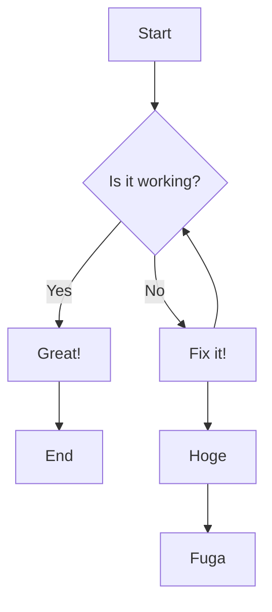

# Mermaid Example

This is a sample slide to test Mermaid rendering.

---

## Flowchart

```mermaid
graph TD;
    A[Start] --> B{Is it working?};
    B -->|Yes| C[Great!];
    B -->|No| D[Fix it!];
    C --> E[End];
    D --> B;
    D --> F[Hoge];
    F --> G[Fuga]
```
