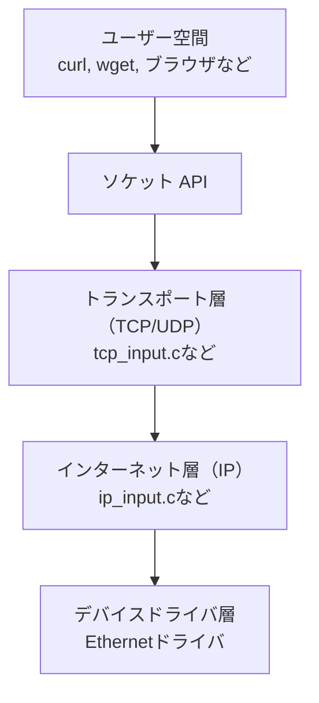

# TCP/IPの基礎とプロトコルスタック

---

## TCP/IPとは？

- インターネット通信の基本となるプロトコル群（プロトコルスイート）
- データの送受信を階層ごとに役割分担
- TCPとIPはそれぞれ異なる層を担当

---

## TCP/IPの4階層モデル

```mermaid
graph TD
  App[アプリケーション層<br/>HTTP / FTP / DNS]
  Trans[トランスポート層<br/>TCP / UDP]
  Net[インターネット層<br/>IP / ICMP / ARP]
  Link[ネットワーク層<br/>Ethernet / Wi-Fi]
  
  App --> Trans --> Net --> Link
````

---

## TCPとIPの違い

| 項目 | TCP             | IP              |
| -- | --------------- | --------------- |
| 層  | トランスポート層        | インターネット層        |
| 役割 | 正確な通信（信頼性・順序保証） | パケットの配送（ルーティング） |
| 例  | Web, メール        | ネットワークの配達経路     |

---

## ソケットの役割

* アプリケーションとTCP/UDPの橋渡し
* OSが提供する通信の窓口（API）
* アプリからは `send()` / `recv()` などで扱う

---

## ソケットの位置づけ

```mermaid
graph TD
  A[アプリケーション層]
  S[ソケットAPI<br/>send/recv]
  T[トランスポート層<br/>TCP/UDP]
  I[インターネット層<br/>IP]
  N[ネットワーク層<br/>Ethernet]

  A --> S --> T --> I --> N
```

---

## プロトコルスタックとは？

* 通信プロトコルの**階層構造を持つソフトウェア群**
* 各階層ごとに独立した役割を持ち、連携して通信を行う
* 通常はOSカーネル内に実装されている

---

## プロトコルスタックの構造（Linux）



---

## スタックの動作イメージ


---

## まとめ

* **TCPとIPは別階層・別機能**
* **ソケットはアプリとTCP/UDPをつなぐ窓口**
* **プロトコルスタックは通信処理を階層化したOS内の構造**
