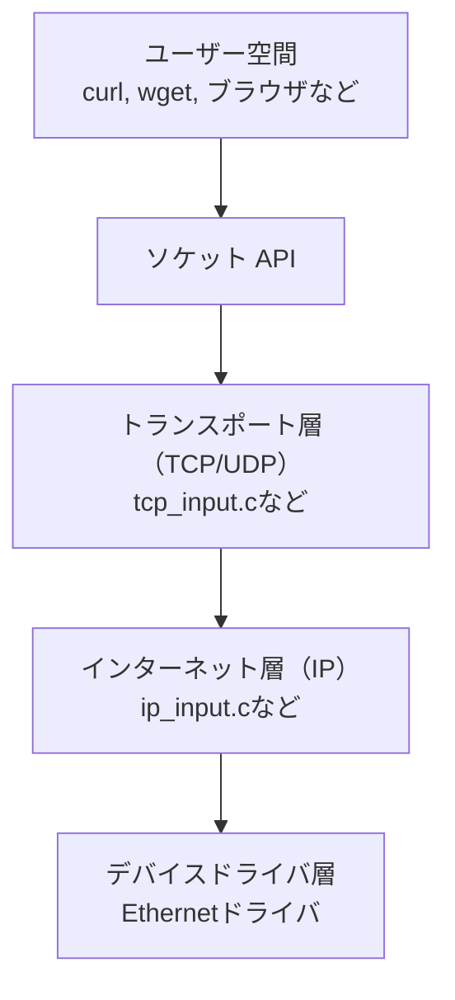
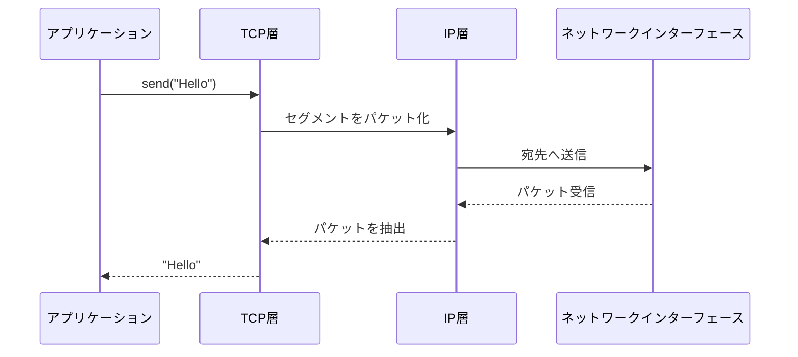

# TCP/IPの基礎とプロトコルスタック

---

## TCP/IPとは？

- インターネット通信の基本となるプロトコル群（プロトコルスイート）
- 役割ごとに階層を分けて設計
- TCPとIPはそれぞれ異なる層を担当

👉 郵便で言えば、  
- **IP** = 郵便局が住所を見て荷物を届ける仕組み  
- **TCP** = 中身が壊れないか確認して、届いたら受領印をもらう仕組み  

---

## TCP/IPの4階層モデル

```mermaid
graph TD
  App[アプリケーション層<br/>HTTP / FTP / DNS]
  Trans[トランスポート層<br/>TCP / UDP]
  Net[インターネット層<br/>IP / ICMP / ARP]
  Link[ネットワーク層<br/>Ethernet / Wi-Fi]
  
  App --> Trans --> Net --> Link
````

* アプリケーション層 = 手紙の内容（文章や写真）
* トランスポート層 = 封筒の整理係（順番通りに並べ直す）
* インターネット層 = 郵便局（住所で仕分け）
* ネットワーク層 = 配達員（実際に届ける）

---

## TCPとIPの違い

| 項目     | TCP          | IP           |
| ------ | ------------ | ------------ |
| 層      | トランスポート層     | インターネット層     |
| 役割     | データの信頼性・順序保証 | パケットを宛先まで届ける |
| 郵便で言えば | 書留・追跡付き郵便    | 普通郵便         |

---

## ソケットの役割

* アプリケーションとTCP/UDPの橋渡し
* OSが提供する通信の窓口（API）
* `send()` / `recv()` などで利用

👉 郵便で言えば、**ポストの投入口**。
手紙を投函すると、裏で郵便局（TCP/IPスタック）が仕分けしてくれる。
受け取りもポストから取り出すだけで済む。

---

## ソケットの位置づけ

```mermaid
graph TD
  A[アプリケーション層]
  S[ソケットAPI<br/>send/recv]
  T[トランスポート層<br/>TCP/UDP]
  I[インターネット層<br/>IP]
  N[ネットワーク層<br/>Ethernet]

  A --> S --> T --> I --> N
```

---

## プロトコルスタックとは？

* 通信プロトコルの**階層構造を持つソフトウェア群**
* 各階層が独立して動き、連携して通信を成立させる
* 通常はOSカーネル内に実装

👉 宅配便で言えば、

* 営業所 → 中継所 → トラック → 配達員
  それぞれ独立した役割を持ちながら、積み重なって荷物が届く。

---

## プロトコルスタックの構造（Linux）



---

## スタックの動作イメージ



👉 手紙で言えば、

* 手紙を書く（アプリ層）
* 封筒に入れて整理（TCP層）
* 郵便局で仕分け（IP層）
* 配達員が届ける（ネットワーク層）

---

## まとめ

* TCPとIPは**別階層・別機能**
* ソケットは**アプリとTCP/UDPをつなぐ窓口**
* プロトコルスタックは**通信処理を階層化した物流システム**
