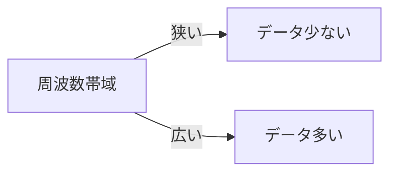
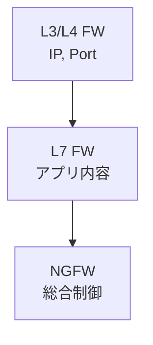

---
# ネットワーク基礎まとめ

私たちが普段使うインターネット通信は  
**プロトコルスタック** によって成り立っています。

アプリが送るデータは階層ごとに処理され、  
最終的に物理的な信号として送信されます。

---

# プロトコルスタック (TCP/IP)

```mermaid
graph TD
  A[アプリケーション層<br/>HTTP, SMTP, DNS] --> B[トランスポート層<br/>TCP, UDP]
  B --> C[ネットワーク層<br/>IP]
  C --> D[リンク層<br/>Ethernet, Wi-Fi, LTE]
````

👉 各層が「役割分担」をして通信を成立させる

---

# ソケットとは？

* アプリが通信するときの **窓口**
* OSが提供するAPI
* 「IPアドレス + ポート番号」で識別

📞 例：ブラウザはソケットを使って
`www.example.com:80` に接続し、HTTPリクエストを送る

---

# データ信号とクロック信号

* **データ信号**: 0/1 の情報
* **クロック信号**: 「いつ読むか」を知らせるリズム

有線LAN → 電圧
無線 → 電波の性質（振幅・周波数・位相）
光 → 光のON/OFFや波長

---

# イーサネットフレームの構造

```mermaid
sequenceDiagram
  participant Sender as 送信側
  participant Receiver as 受信側

  Sender->>Receiver: プリアンブル (1010…)
  Sender->>Receiver: SFD (Start Frame Delimiter)
  Sender->>Receiver: 宛先MAC, 送信元MAC
  Sender->>Receiver: データ (IPパケット)
  Sender->>Receiver: FCS (エラーチェック)
```

👉 プリアンブルで同期し、SFDで本番開始！

---

# L2スイッチ

* MACアドレスを見てフレームを仕分ける
* 宛先がわからなければ全ポートにフラッディング
* ハブより賢い「郵便局員」

📮 例：
「MAC\:AA-BB-CC → ポート3」という対応表を持っている

---

# 電波と帯域

* **帯域幅** = 使える周波数の幅
* 広いほど一度に多くのデータを送れる
* 電波は有限資源 → 国が用途ごとに割り当て



---

# 帯域の分け合い方

* **TDMA**: 時間を分け合う
* **FDMA**: 周波数を分け合う
* **OFDMA**: 周波数を細かく分割して同時利用
* **MIMO**: 空間的に分け合う（複数アンテナ）

🚗 道路の例：

* 車線 = FDMA
* 信号で順番 = TDMA
* 並列に車線分け + 時間制御 = OFDMA

---

# 地デジと携帯の違い

* **地デジ** = 放送型
  → 全員に同じデータを一斉配信、混雑しない
* **携帯** = 通信型
  → ユーザーごとに別データ、混雑すると1人あたりの速度が低下

📺 地デジは安定画質
📱 携帯は状況に応じて動画の画質が落ちる

---

# 光回線の特徴

* 光は真空中で秒速30万km
* 光ファイバー中は約20万km/s（2/3倍速）
* 減衰が少なく、大容量に強い
* インターネットのバックボーンや海底ケーブルに利用

---

# ICMP

* IPを補助する制御用プロトコル
* **エラーメッセージ係**

  * 宛先不達, TTL超過, 断片化が必要 など
* **診断ツール**

  * ping（生死確認）
  * traceroute（経路確認）

---

# ファイアウォール

* **L3/L4 (iptablesなど)**
  IPアドレスやポート番号で制御
* **L7 (プロキシ型)**
  HTTPリクエストやメール本文まで解析
* **次世代型 (NGFW)**
  DPIで詳細解析、ユーザー単位制御も可能



---

# まとめ

* プロトコルスタック = 通信の階層構造
* ソケット = アプリが通信する窓口
* 信号 = 有線は電圧, 無線は電波, 光はレーザー
* イーサネット = プリアンブルで同期、MACで仕分け
* L2スイッチ = MACアドレスで転送
* 帯域 = 周波数の幅（有限資源）
* ICMP = ネットワークのエラーメッセージ係
* ファイアウォール = L3〜L7で通信を制御

```

---
